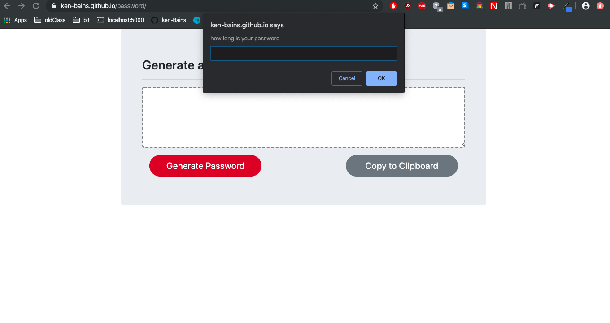

# Password Generator

## Summary 
This site generates a random password depending on the criteria you have choosen. Criteria include special charcters, numeric numbers, uppercase letters, and lowercase letters.

## Link to site
https://ken-bains.github.io/password/

## Site Picture



## Technologies Used
- HTML - used to create elements on the DOM
- CSS - styles html elements on page
- Git - version control system to track changes to source code
- GitHub - hosts repository that can be deployed to GitHub Pages
- Bootstrap - front-end framework used to create modern websites and web apps.

## Code Snippet
```javascript
function createPassword() {
    var newString = "";
        newPassword = "";

    if (specialChar === false && numericNumbers === false && uppercaseLetters === false && lowercaseLetters === false) {
        alert ("please pick a character type");
        newPassword = "PLEASE PICK A CHARCTER TYPE TO GENERATE PASSWORD";
        newPasswordCreated = newPassword;
        return
    }

    if (specialChar === true) {
        newString += specialCharString;
    } 
    if (numericNumbers === true) {
        newString += numberString;
    }
    if (uppercaseLetters === true) {
        newString += uppercaseString;
    }
    if (lowercaseLetters === true) {
        newString += lowercaseString;
    }

    for (var i = 1; i <= lengthOfPassword; i++) {
        var num = Math.floor(Math.random() * newString.length);
        newPassword += newString[num];
    }

    newPasswordCreated = newPassword;
};

```
- The code snipit above is an example of code that was used to create the password. 


## Author Links
[LinkedIn](https://www.linkedin.com/in/ken-bains)
[GitHub](https://github.com/ken-Bains)
